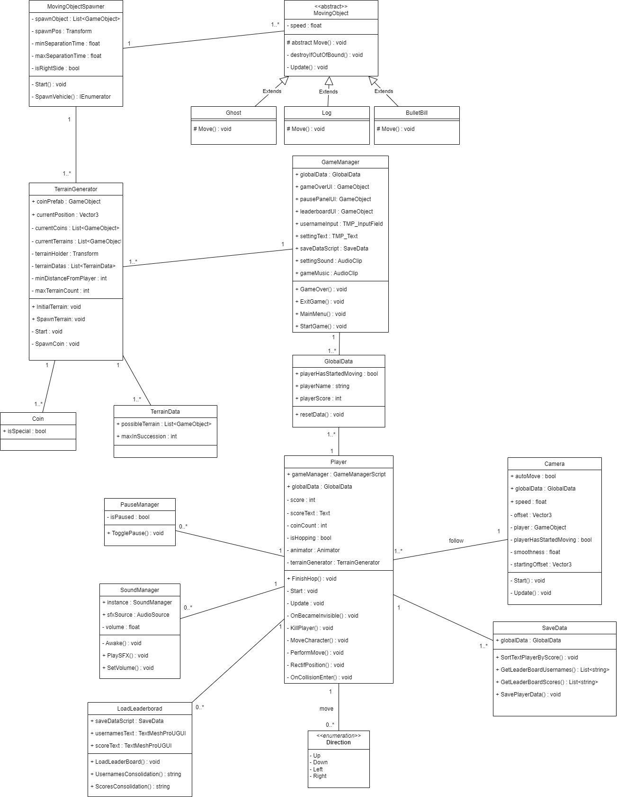
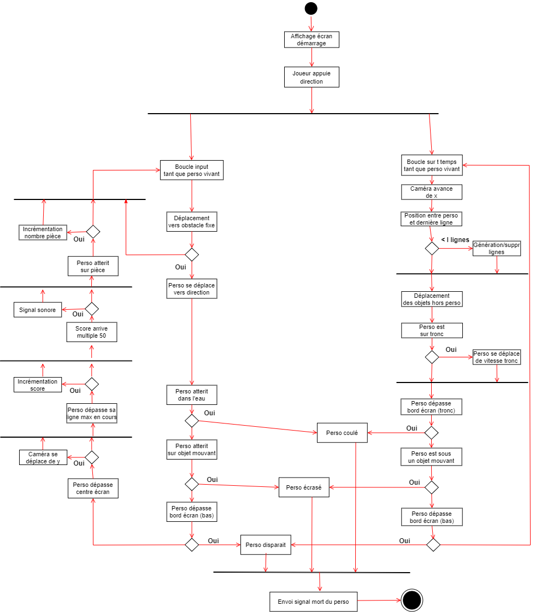
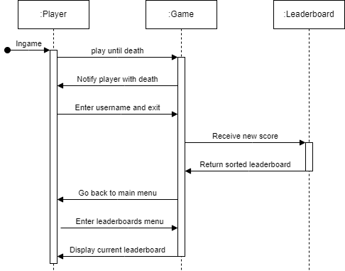
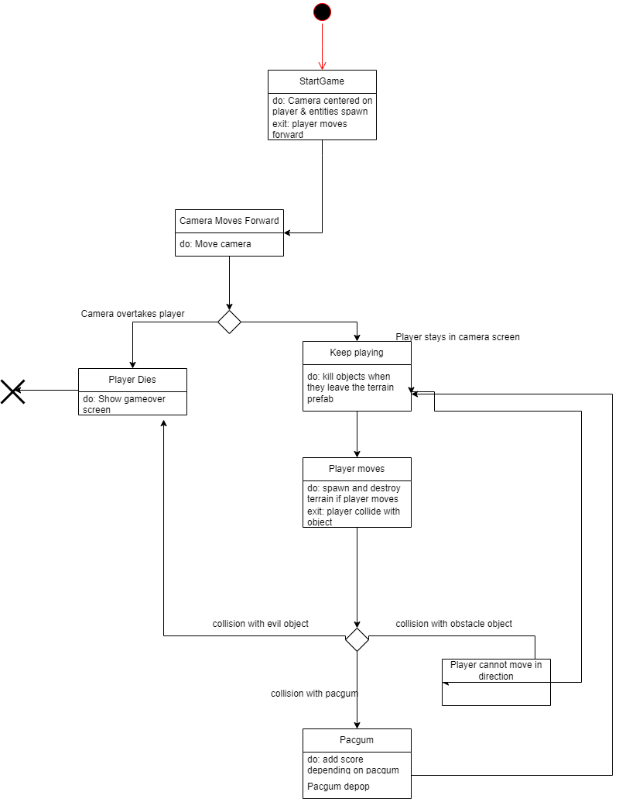
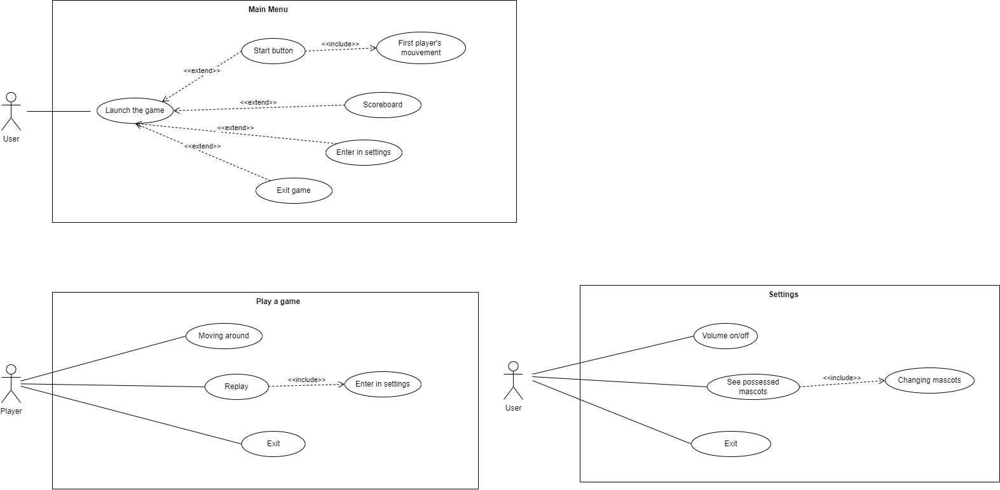

<h1 align="center">Paco Road Documentation</h1>
 

<h2>This is the repository for our project documentation</h2>
<h4>
    <a href="https://github.com/Paco-crossing-the-roads/Crossy_Roads_Cnam/releases/tag/v3.0.0">Go to the definitive release</a>
   · 
    <a href="https://github.com/Paco-crossing-the-roads/Crossy_Roads_Cnam">Go to the repository</a>
   · 
    <a href="https://github.com/Paco-crossing-the-roads/Crossy_Roads_Cnam/issues">Report a bug</a>
   · 
    <a href="https://github.com/orgs/Paco-crossing-the-roads/projects/2">Go to the board</a>
  </h4>

# :notebook_with_decorative_cover: Summary

- [:star2: About the project](#star2-about-the-project)
  - [:space_invader: Technologies](#space_invader-technologies)
- [:toolbox: Getting Started](#toolbox-getting-started)
  - [:bar_chart: Issue Board](#bar_chart-issue-board)
  - [:pencil: Technical Documentation](#pencil-technical-documentation)
  - [:pencil: User Documentation](#pencil-user-documentation)
  - [:gear: UML](#gear-uml)
- [:copyright: Contributors](#copyright-contributors)

## :star2: About the project

This project is based on a reproduction of the crossy road game. 
We had the option of modifying the assets and we decided to make the game using the Pac-Man assets. 
The aim of this project is to produce an executable of the game to validate the OOP and UML subjects. 

### :space_invader: Technologies

  
  

# :toolbox: Getting Started

We're going to show you our project organization and the UML diagrams we've produced.

# :bar_chart: Issue Board

To organize our work, we set up an issue board using GitHub's functionalities. 
This board enabled us to track the progress of issues, to know who was assigned to them and whether they were in todo or in progress. 
We invite you to visit our [Issue Board](https://github.com/orgs/Paco-crossing-the-roads/projects/2)

# :pencil: Technical Documentation

We've summarized the main functions of the project and the game environment we've created. 
We have written the specifications for our game in the following documents:

- [Tech Doc EN](https://github.com/Paco-crossing-the-roads/Crossy_Road_Documentation/tree/main/Technical_documentation/English/README.md)
- [Tech Doc FR](https://github.com/Paco-crossing-the-roads/Crossy_Road_Documentation/tree/main/Technical_documentation/French/README.md)

# :pencil: User Documentation

We've also written a user documentation to make your experience easier. 
You can find the documentation in the following documents:

- [User Doc EN](https://github.com/Paco-crossing-the-roads/Crossy_Road_Documentation/tree/main/User_documentation/English/README.md)
- [User Doc FR](https://github.com/Paco-crossing-the-roads/Crossy_Road_Documentation/tree/main/User_documentation/French/README.md)

# :gear: UML

## Gantt Diagram

The gantt chart is only available in PDF format.
[Gantt Diagram](./Gantt_Diagram.pdf)

## Class Diagram

## Activity Diagram

## Sequence Diagram

## State Diagram

## Use Case Diagram

# :copyright: Contributors

- **Vladimir SACCHETTO** _alias_ [@VladimirSacchetto](https://github.com/Vladimir9595)
- **Ian BELLOT** _alias_ [@IanBellot](https://github.com/ShortLegsFox)
- **Hugo TREGNAGO** _alias_ [@HugoTregnago](https://github.com/htregnagoCNAM)

(<a href="#readme-top">back to top</a>)

