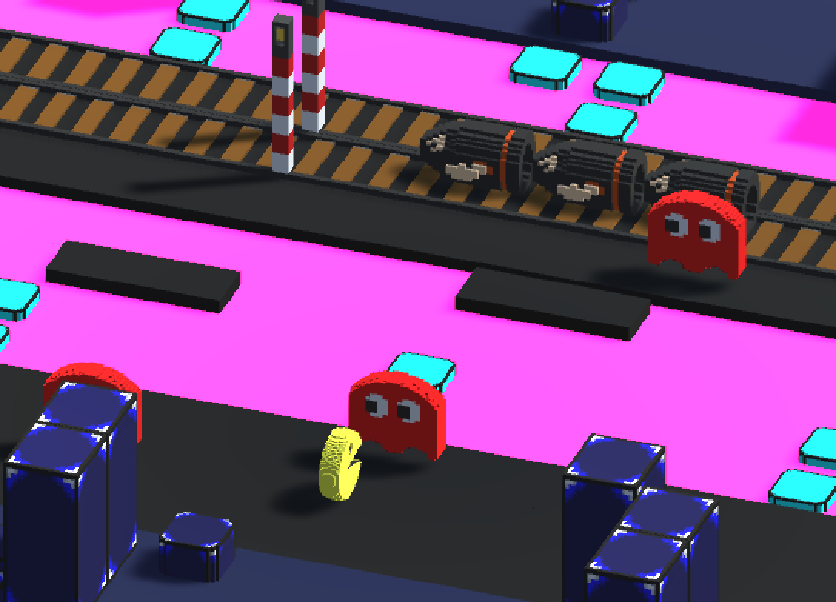
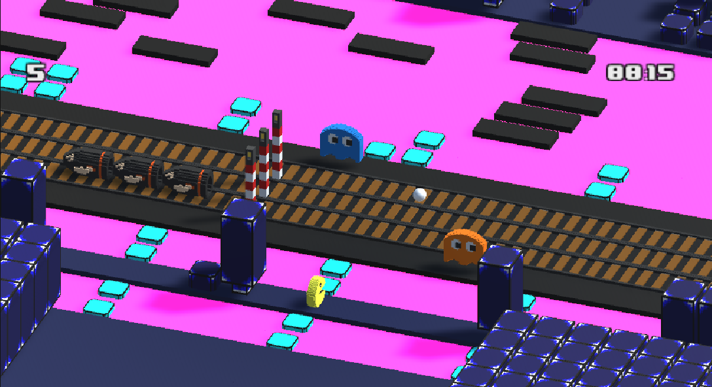
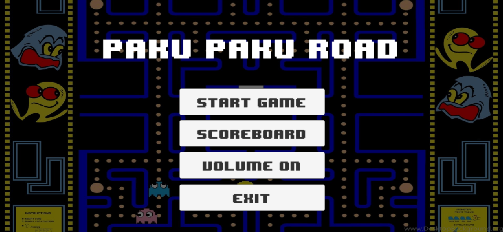
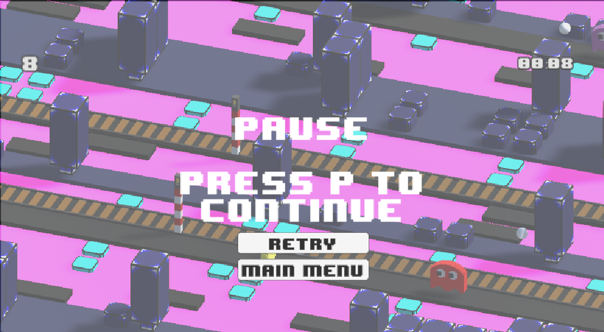

<h1 align="center">Paco Road technical documentation</h1>
 

<h2>It's the technical documentation</h2>

# :notebook_with_decorative_cover: Summary

- [:globe_with_meridians: Introduction](#globe_with_meridians-introduction)
  - [:book: Need description](#book-need-description)
    - [:dart: Educational objectives of the project](#dart-educational-objectives-of-the-project)
    - [:keyboard: Scope and limitation](#keyboard-scope-and-limitation)
- [:gear: Product functions](#gear-product-functions)
  - [:video_game: Crossy road gameplay](#video_game-crossy-road-gameplay)
  - [:moneybag: Scoring and gold coins](#moneybag-scoring-and-gold-coins)
  - [:gear: Start menu](#gear-start-menu)
  - [:gear: Pause menu](#gear-pause-menu)
  - [:gear: Option menu](#gear-option-menu)
  - [:gear: Score menu](#gear-score-menu)
  - [:robot: Pathfinding algorithm](#robot-pathfinding-algorithm)
- [:wave: Conclusion](#wave-conclusion)
- [:copyright: Contributors](#copyright-contributors)

# :globe_with_meridians: Introduction

## :book: Need description

As part of an educational project, we have been asked to produce a video game based on the existing “Crossy Road” mobile game. The project is not intended to be commercialized, and has been created for purely educational purposes, to show two aspects of the computer engineering profession:

- object-oriented development
- Project management and general information systems methodology.

In addition to the basic Crossy Road gameplay with its score and time interface, we'll also be creating a score-saving system, an introduction menu, a pause menu and an option menu.

## :dart: Educational objectives of the project

- **Mastering the fundamentals of programming**: Learn and reinforce the student's programming skills.
- **Object-oriented design**: Make the most of object-oriented programming concepts, and structure your program properly.
- **Use of UML analysis**: Use the various analysis tools to better plan and manage your project as development progresses.
- **Source code and planning control**: Use tools such as Git to version your code and create deliverables.
- **Event and animation management**: Use events to control characters and menus, and integrate animations to enhance the user experience.
- **Game customization**: Students will be able to integrate new features into the game to develop their creativity.

## :keyboard: Scope and limitation

- **Technical constraints**: Developed in C# and Unity
- **Group constraints**: The project must be developed in a group. Our working group is made up of 3 people who will have to divide the tasks between them.
- **Time constraint** : The project must be handed in no later than 23:59 on 17/05/2024.
- Deliverable constraint\*\*: The project must be rendered as a Windows executable in the release branch of the source manager. Source code must be accessible.

# :gear: Product functions

## :video_game: Crossy road gameplay

Crossy Road is an infinite scrolling game, meaning that the end of the game depends solely on the character's death. The player controls the mascot as it moves through a procedurally-generated course littered with obstacles. The mascot can move in the 4 cardinal directions and must avoid the following obstacles:

- Moving vehicles (car, truck, train) that cause the character's immediate death.
- Water in which the mascot immediately drowns
- Non-moving objects (trees, rocks) that prevent the mascot from moving in that direction.
  In the case of water, there are tree trunks that move according to the course of the water; if a mascot lands on them, they move along with the trunk. There are also water lilies that are fixed to the water.
  The character is also forced to move forward. If there is no movement for a certain period of time, an eagle will attack and cause the end of the game.

## :moneybag: Scoring and gold coins

The player is encouraged to play again for two different reasons:

- To improve their score: the score is established according to the number of different lines the mascot has touched.
- To collect gold coins: gold coins are scattered around the field, and can be used to pay for new game mascots.

## :gear: Start menu

When you launch the game, you can choose to play, select different difficulties, view the difficulty ranking or quit. This menu is also accessible after the mascot has died, if you choose to return to it, and also from the pause menu.

## :gear: Pause menu

At any time, the player can pause the game to continue later, start from scratch or return to the start menu. This menu must be accessible at the touch of a button.

## :gear: Option menu

This menu allows you to activate or deactivate the game sound.

## :gear: Score menu

This menu displays the player's best score.

## :robot: Pathfinding algorithm

A robot must be designed to play the game automatically, without requiring any input from the user. It will use a path-finding and collision avoidance algorithm (see game loop).

# :wave: Conclusion

The purpose of this document is to describe the functionalities of the Paco Road game. It is intended to help the development team understand the customer's expectations and the features to be implemented.

# :copyright: Contributors

- **Vladimir SACCHETTO** _alias_ [@VladimirSacchetto](https://github.com/Vladimir9595)
- **Ian BELLOT** _alias_ [@IanBellot](https://github.com/ShortLegsFox)
- **Hugo TREGNAGO** _alias_ [@HugoTregnago](https://github.com/htregnagoCNAM)

(<a href="#readme-top">back to top</a>)

