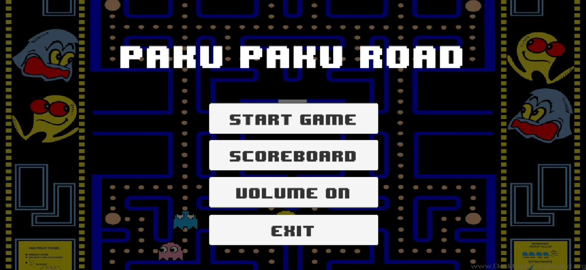

<h1 align="center">Paco Road Documentation technique</h1>
 

<h2>C'est la documentation technique</h2>

# :notebook_with_decorative_cover: Sommaire

- [:globe_with_meridians: Introduction](#globe_with_meridians-introduction)
  - [:book: Description du besoin](#book-description-du-besoin)
  - [:dart: Objectifs éducatifs du projet](#dart-objectifs-éducatifs-du-projet)
  - [:keyboard: Portée et limitation](#keyboard-portée-et-limitation)
- [:gear: Fonctions du produit](#gear-fonctions-du-produit)
  - [:video_game: Gameplay de Crossy road](#video_game-gameplay-de-crossy-road)
  - [:moneybag: Scoring et pièces en or](#moneybag-scoring-et-pièces-en-or)
  - [:gear: Menu de démarrage](#gear-menu-de-démarrage)
  - [:gear: Menu de pause](#gear-menu-de-pause)
  - [:gear: Menu option](#gear-menu-option)
  - [:gear: Menu score](#gear-menu-score)
  - [:robot: Algorithme de pathfinding](#robot-algorithme-de-pathfinding)
- [:wave: Conclusion](#wave-conclusion)
- [:copyright: Contributeurs](#copyright-contributeurs)

# :globe_with_meridians: Introduction

## :book: Description du besoin

Dans le cadre d’un projet pédagogique, il est demandé de produire un jeu vidéo basé sur le jeu mobile existant « Crossy Road ». Le projet n’a pas pour vocation d’être commercialisé et est créé à but purement éducatif afin de voir deux pans du métier d’ingénieur informatique :

- Le développement objet
- La gestion de projet et la méthodologie générale des systèmes d’informations
  En plus du gameplay de base de Crossy Road avec son interface de score et temps, il faudra également création un avec système de sauvegarde de score, menu d’introduction, menu de pause et menu d’option.

## :dart: Objectifs éducatifs du projet

- **Maîtrise des fondamentaux de la programmation** : Apprendre et renforcer les compétences en programmation de l’étudiant
- **Conception orienté objet** : Utiliser à bon escient les concepts de la programmation objet, bien structurer son programme
- **Utilisation de l’analyse UML** : Utiliser les différents outils d’analyse pour mieux planifier et gérer son projet au fur et à mesure du développement
- **Contrôle du code source et de la planification** : Utiliser un outil tel que Git pour versionner son code et créer des livrables
- **Gestion des évènements et des animations** : Utiliser des évènements pour contrôler le personnage et les menus, il est également demandé d’intégrer des animations pour améliorer l’expérience utilisateur
- **Personnalisation du jeu** : Les étudiants pourront à leur guise intégrer des nouvelles fonctionnalités dans le jeu pour développer leur créativité

## :keyboard: Portée et limitation

- **Contrainte technique** : Développé en C# et Unity
- **Contrainte de groupe** : Le projet doit être développé en groupe. Notre groupe de travail est composé de 3 personnes qui devront se répartir les tâches.
- **Contrainte de temps** : Le projet doit être rendu le 17/05/2024 à 23h59 au plus tard
- **Contrainte de livrable** : Le rendu doit être fait sous la forme d’un exécutable Windows dans la branche release du gestionnaire de source. Le code source doit être accessible.

# :gear: Fonctions du produit

## :video_game: Gameplay de Crossy road

Crossy road est un jeu de type scrolling infini ; c’est-à-dire que la fin du jeu dépend uniquement de la mort du personnage. Le joueur contrôle la mascotte qui avance dans un parcours généré procéduralement jonché d’obstacles. La mascotte peut se déplacer dans les 4 mouvements cardinaux et doit éviter les obstacles suivants :

- Les véhicules mouvants (voiture, camion, train) qui cause la mort immédiate du personnage
- L’eau dans laquelle la mascotte se noie immédiatement
- Les objets non mouvants (arbre, rocher) qui empêche la mascotte de se déplacer vers cette direction
  Dans le cas de l’eau, il existe des troncs d’arbres qui se déplace selon le cours de l’eau, si un mascotte se pose dessus, elle se déplace en même temps que le tronc. Il y a également des nénuphars qui sont fixes sur l’eau.
  Le personnage est également forcé d’avancer. Si absence de déplacement durant un certain temps, un aigle va attaquer la partie et causer la fin de la partie.

## :moneybag: Scoring et pièces en or

Le joueur est incité à rejouer pour deux raisons différentes :

- Améliorer son score : le score est établi selon le nombre de ligne différente que la mascotte a touché
- Récupérer des pièces d’or : des pièces d’or sont disséminés sur le terrain qui peuvent être utilisées pour payer notamment des nouvelles mascottes de jeu.

## :gear: Menu de démarrage

Lorsque le joueur lance le jeu, il a le choix entre jouer, choisir des difficultés différentes, visualiser le classement par difficulté ou quitter le jeu. Ce menu est accessible également après la mort de la mascotte si on choisit de revenir dessus et également depuis le menu de pause.

## :gear: Menu de pause

Le joueur peut à tout moment mettre en pause le jeu pour continuer sa partie plus tard, recommencer de zéro ou revenir sur le menu de démarrage. Ce menu doit être accessible via la pression d’une touche.

## :gear: Menu option

Ce menu permet d’activer ou désactiver le son du jeu.

## :gear: Menu score

Ce menu permet de consulter le meiulleur score du joueur.

## :robot: Algorithme de pathfinding

Un robot devra être conçu pour jouer automatiquement au jeu sans demander d’inputs de l’utilisateur. Il utilisera un algorithme de recherche de chemin et de prévention des collisions (voir boucle de jeu).

# :wave: Conclusion

Ce document a pour but de décrire les fonctionnalités du jeu Paco Road. Il est destiné à l'équipe de développement pour qu'elle puisse comprendre les attentes du client et les fonctionnalités à implémenter.

# :copyright: Contributeurs

- **Vladimir SACCHETTO** _alias_ [@VladimirSacchetto](https://github.com/Vladimir9595)
- **Ian BELLOT** _alias_ [@IanBellot](https://github.com/ShortLegsFox)
- **Hugo TREGNAGO** _alias_ [@HugoTregnago](https://github.com/htregnagoCNAM)

(<a href="#readme-top">back to top</a>)

