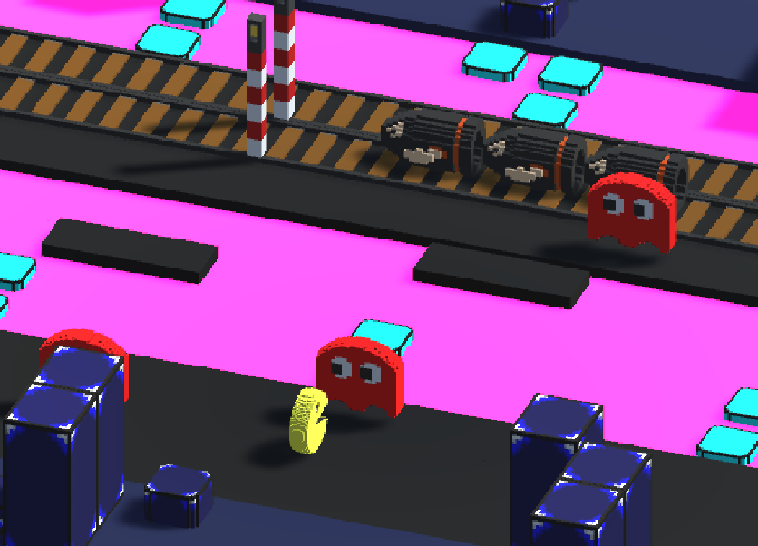
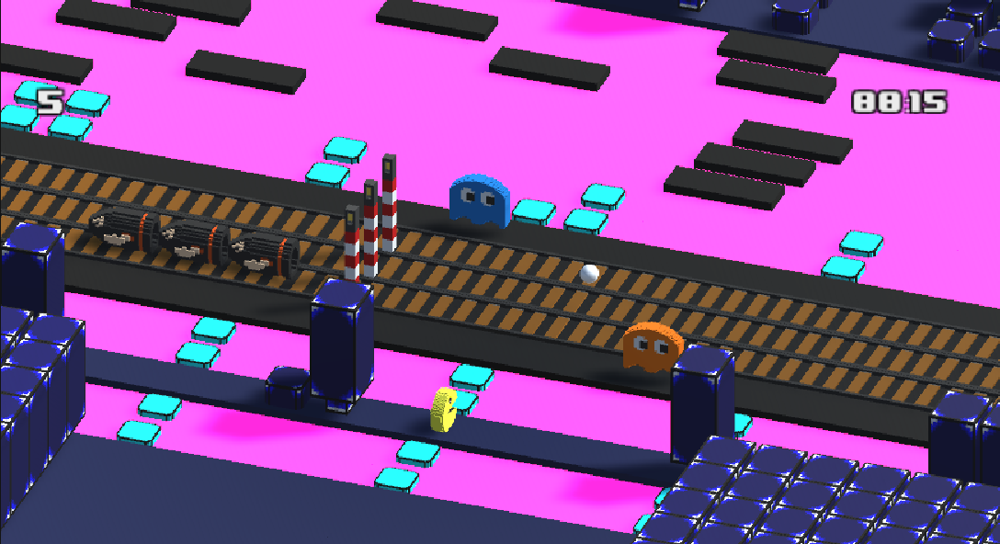
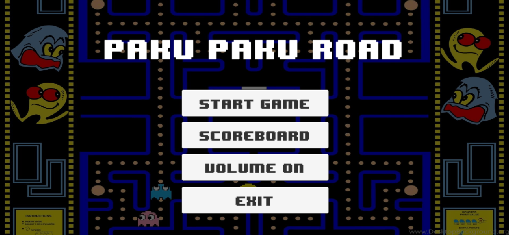
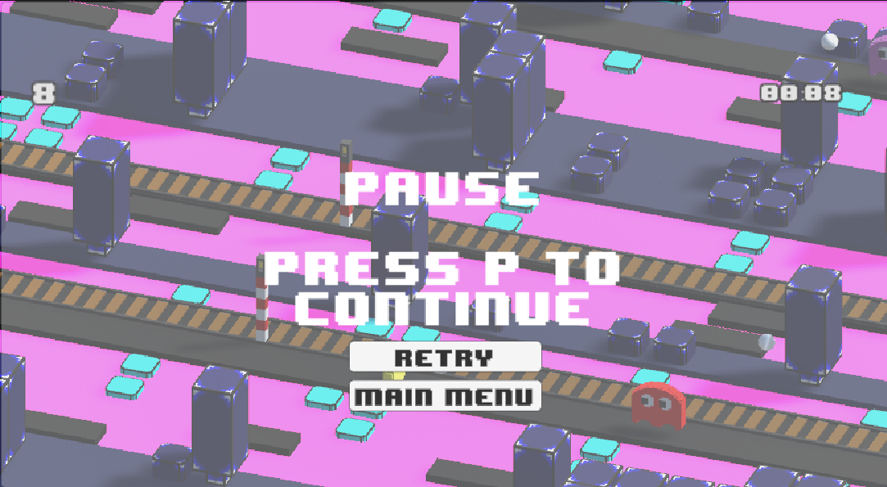
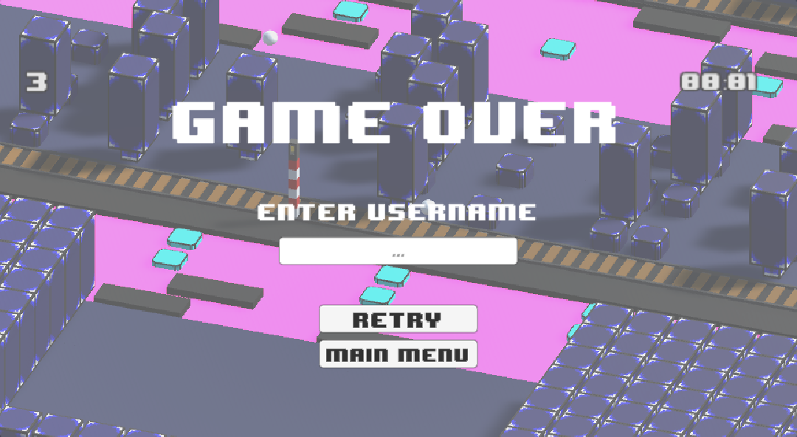

<h1 align="center">Paco Road User documentation</h1>
 

<h2>This is the user documentation</h2>

# :notebook_with_decorative_cover: Summary

- [:octocat: Introduction](#octocat-introduction)
- [:video_game: Game Mode](#video_game-game-mode)
  - [:dart: Objective](#dart-objective)
  - [:gear: Main menu](#gear-main-menu)
  - [:keyboard: Game Controls](#keyboard-game-controls)
  - [:pause_button: Pause](#pause_button-pause)
  - [:moneybag: Coin collection](#moneybag-coin-collection)
  - [:no_entry: Obstacles and Dangers](#no_entry-obstacles-and-dangers)
  - [:end: End of Game](#end-end-of-game)
  - [:top: Playing Tips](#top-playing-tips)
- [:wave: Conclusion](#wave-conclusion)
- [:copyright: Contributors](#copyright-contributors)

# :octocat: Introduction

Paco Crossy Road is the project for our first-year engineering diploma, based on the popular arcade game where the player controls a character who has to cross a series of roads, rivers and other obstacles without getting run over or falling into the water. The aim is to progress as far as possible while collecting coins to unlock new characters. 
We used assets from the famous Pac-Man game to create a world that differs from Crossy Road.

# :video_game: Game Mode

## :dart: Objective

The main aim of Paco Crossy Road, as in the real game, is to get the character across roads, rivers and other obstacles while avoiding hazards. As the character progresses, the player's score increases.

## :gear: Main menu

When the game is launched, a main menu appears. Here you can choose to start a new game, view high scores, change the game volume, or quit the game.

## :keyboard: Game Controls

- **Character movement**:
  - :arrow_up: **Arrow Up** : Move forward
  - :arrow_down: **Arrow Down** : Move back
  - :arrow_left: **Arrow Left** : Move left
  - :arrow_right: **Arrow Right** : Move right

<!-- ## :parking: Pause -->

## :pause_button: Pause

To pause the game, press the **P** key. The game will stop, and a pause menu will appear. You can resume play by pressing the **P** key again, or by selecting the corresponding option in the pause menu.

## :moneybag: Coin collection

Throughout the game, coins will appear along the way. Collect them to increase your score and unlock new characters.

## :no_entry: Obstacles and Dangers

- :car: **Roads**: Cars and trucks drive on the roads. Avoid them to avoid being run over.
- :droplet: **Rivers**: Use tree trunks and water lilies to cross rivers. Falling into the water will result in a loss.
- :bullettrain_side: **Train Tracks**: Trains pass over the tracks at high speed. Cross quickly to avoid being hit.

## :end: End of Game

The game ends when the character is run over by a car, falls into water, or is hit by a train. An end-of-game screen will appear, displaying your final score and your name. The menu allows you to start a new game or return to the main menu.

## :top: Playing Tips

- Take your time to observe the pattern of cars and other hazards before crossing.
- Use the floating logs and other objects to plan your river crossing.
- Try to collect as many coins as possible to unlock new characters.

# :wave: Conclusion

Crossy Road is a simple yet addictive game, offering a fun and challenging experience for all ages. Use the arrow keys to move your character and the P key to pause when necessary. Collect coins and avoid obstacles to achieve the highest possible score.

Have fun and try to beat your own record !

# :copyright: Contributors

- **Vladimir SACCHETTO** _alias_ [@VladimirSacchetto](https://github.com/Vladimir9595)
- **Ian BELLOT** _alias_ [@IanBellot](https://github.com/ShortLegsFox)
- **Hugo TREGNAGO** _alias_ [@HugoTregnago](https://github.com/htregnagoCNAM)

(<a href="#readme-top">back to top</a>)

