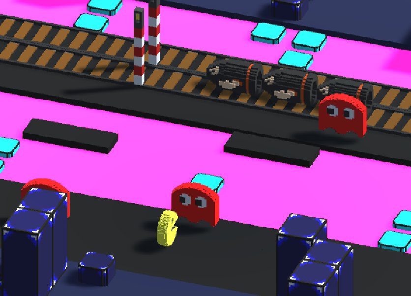
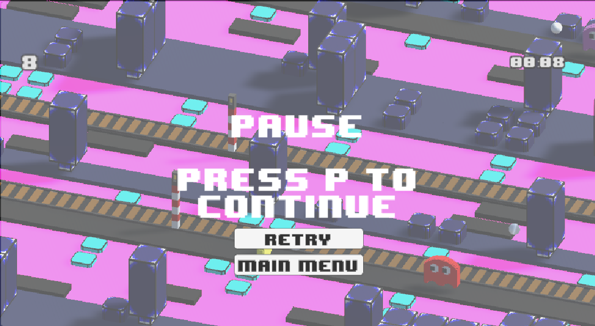

<h1 align="center">Paco Road Documentation utilisateur</h1>
 

<h2>C'est la documentation utilisateur</h2>

# :notebook_with_decorative_cover: Sommaire

- [:octocat: Introduction](#octocat-introduction)
- [:video_game: Mode de Jeu](#video_game-mode-de-jeu)
  - [:diamond_shape_with_a_dot_inside: Objectif](#diamond_shape_with_a_dot_inside-objectif)
  - [:gear: Menu principal](#gear-menu-principal)
  - [:keyboard: Commandes de Jeu](#keyboard-commandes-de-jeu)
  - [:pause_button: Pause](#pause_button-pause)
  - [:moneybag: Collecte de Pièces](#moneybag-collecte-de-pièces)
  - [:no_entry: Obstacles et Dangers](#no_entry-obstacles-et-dangers)
  - [:end: Fin de Partie](#end-fin-de-partie)
  - [:top: Conseils pour Jouer](#top-conseils-pour-jouer)
- [:wave: Conclusion](#wave-conclusion)
- [:copyright: Contributeurs](#copyright-contributeurs)

# :octocat: Introduction

Paco Crossy Road est le projet pour notre première année du diplôme d'ingénieur qui se base sur le réel jeu d'arcade populaire où le joueur contrôle un personnage qui doit traverser une série de routes, rivières et autres obstacles sans se faire écraser ou tomber dans l'eau. L'objectif est de progresser le plus loin possible tout en collectant des pièces pour débloquer de nouveaux personnages. 
Nous avons utilisé les assets du célèbre jeu Pac-Man afin de réaliser un univers diffèrent du jeu Crossy Road.

# :video_game: Mode de Jeu

## :diamond_shape_with_a_dot_inside: Objectif

Le but principal de Paco Crossy Road, comme pour le jeu réel, est de faire traverser le personnage à travers des routes, des rivières, et d'autres obstacles tout en évitant les dangers. Plus le personnage progresse, plus le score du joueur augmente.

## :gear: Menu principal

Au lancement du jeu, un menu principal apparaîtra. Vous pourrez y choisir de commencer une nouvelle partie, de consulter les meilleurs scores, de modifier le volume du jeu, ou de quitter le jeu.

## :keyboard: Commandes de Jeu

- **Mouvement du personnage**:
  - :arrow_up: **Flèche Haut** : Avancer
  - :arrow_down: **Flèche Bas** : Reculer
  - :arrow_left: **Flèche Gauche** : Se déplacer à gauche
  - :arrow_right: **Flèche Droite** : Se déplacer à droite

<!-- ## :parking: Pause -->

## :pause_button: Pause

Pour mettre le jeu en pause, appuyez sur la touche **P**. Le jeu s'arrêtera, et un menu de pause apparaîtra. Vous pourrez reprendre le jeu en appuyant de nouveau sur la touche **P** ou en sélectionnant l'option correspondante dans le menu de pause.

## :moneybag: Collecte de Pièces

Tout au long du jeu, des pièces apparaîtront sur le chemin.  Ramassez-les pour augmenter votre score et débloquer de nouveaux personnages.

## :no_entry: Obstacles et Dangers

- :car: **Routes**: Les voitures et camions circulent sur les routes. Évitez-les pour ne pas vous faire écraser.
- :droplet: **Rivières**: Utilisez les troncs d'arbres et les nénuphars pour traverser les rivières. Tomber dans l'eau entraînera une perte.
- :bullettrain_side: **Rails de Train**: Les trains passent à grande vitesse sur les rails. Traversez rapidement pour éviter d'être heurté.

## :end: Fin de Partie

Le jeu se termine lorsque le personnage est écrasé par une voiture, tombe dans l'eau, ou est heurté par un train. Un écran de fin de partie apparaîtra, affichant votre score final ainsi que la saise de votre nom. Le menu permet de recommencer une nouvelle partie ou revenir au menu principal.

## :top: Conseils pour Jouer

- Prenez votre temps pour observer le schéma des voitures et autres dangers avant de traverser.
- Utilisez les troncs flottants et autres objets pour planifier votre traversée des rivières.
- Essayez de collecter autant de pièces que possible pour débloquer de nouveaux personnages.

# :wave: Conclusion

Crossy Road est un jeu simple mais addictif, offrant une expérience amusante et stimulante pour tous les âges. Utilisez les flèches pour déplacer votre personnage et la touche P pour faire une pause lorsque nécessaire. Collectez des pièces et évitez les obstacles pour obtenir le meilleur score possible.  

Amusez-vous bien et essayez de battre votre propre record !

# :copyright: Contributeurs

- **Vladimir SACCHETTO** _alias_ [@VladimirSacchetto](https://github.com/Vladimir9595)
- **Ian BELLOT** _alias_ [@IanBellot](https://github.com/ShortLegsFox)
- **Hugo TREGNAGO** _alias_ [@HugoTregnago](https://github.com/htregnagoCNAM)

(<a href="#readme-top">back to top</a>)

